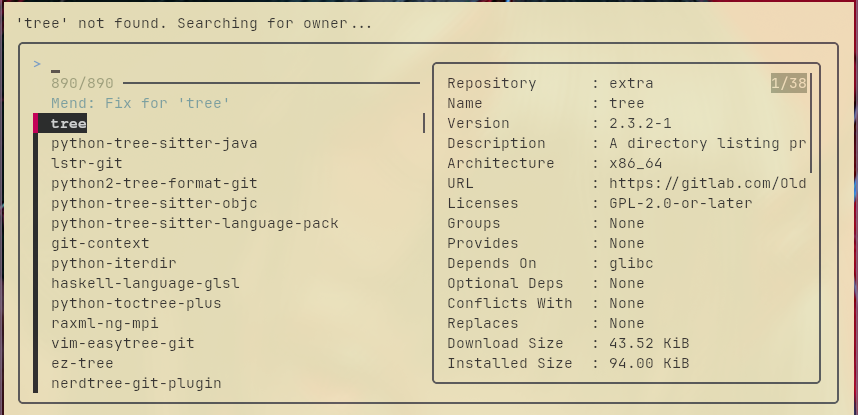

# Mend


[](https://github.com/unixorn/awesome-zsh-plugins)
[](https://github.com/Rakosn1cek/mend)
[](https://github.com/Rakosn1cek/mend/releases)
[](https://discord.gg/GFk45RdS)


Version: [0.8.2]

## Hardware Support
Mend uses a local database (`hardware.db`) to map PCI IDs to distro-specific packages. Currently, it scans and identifies:
* **Graphics:** NVIDIA, AMD, Intel.
* **Networking:** Wi-Fi and Ethernet (Intel, Realtek, etc.).
* **Audio:** Intel, AMD, and Realtek sound controllers.
* **Connectivity:** USB 3.0/3.1 controllers and Bluetooth modules.
* **Input:** I2C and HID Touchpads.

### Fixed in v0.8.2
- `mend -h` function has been fixed and is fully working. Thank you for the issue reporting.

---



**Mend in Action:**
<p align="center">
  <video src="https://github.com/user-attachments/assets/40718abf-3418-4cf2-8e9f-7c3a9cb2d12b" width="600" controls muted autoplay loop>
    Your browser does not support the video tag.
  </video>
</p>

## What it does for you

Most of the time, Linux errors are just small hurdles. You might be missing a specific bit of software, a security key, or another update might be blocking your progress. Mend looks at the very last thing that happened on your screen, figures out why it failed, and offers you a one-click fix.
It can help you find and install missing programmes even if you don't know their exact names. It also handles the "behind the scenes" maintenance, like clearing out old files you no longer need or refreshing your connection to the update servers if they're being slow.

## Must have for **Mend** to work
- **Zsh**: The specific command-line shell the tool is written for.
- **fzf**: Provides the interactive menus and search windows.
- **sudo**: Required to fix system files or install software.
- **pciutils**: Required for the hardware scanner to identify your devices.  
- **Package Managers**: One of the following: pacman (Arch), apt (Ubuntu/Mint), zypper (openSUSE), or dnf (Fedora).
- **apt-file**: Only for Ubuntu or Mint systems to find missing library files.
- **Standard Linux Tools**: Uses common tools like grep, sed, awk, and history to read and understand your error messages.
- **Internet Access**: Needed to fetch security keys or download missing files.

## Getting started

**Option A**: Arch Linux (Recommended)
Install the package using your favourite AUR helper:

`yay -S zsh-mend-git`

Then, add this line to the bottom of your .zshrc file:
```zsh
source /usr/share/zsh/plugins/mend/mend.plugin.zsh
fpath=(/usr/share/zsh/plugins/mend/functions $fpath)
autoload -Uz mend
```
**Option B**: Manual install

1. **Download the tool**
Copy the files to your computer by running:
 `git clone https://github.com/Rakosn1cek/mend.git ~/mend`

2. **Set it up**
Add this line to the bottom of your `.zshrc` file:
 `source ~/mend/mend.plugin.zsh`

3. **Initialize File Database (Arch only)**
For "Command Not Found" and library repairs to work, sync your database:
 `sudo pacman -Fy`
> *Note: From v0.5.0, Mend will prompt you if this is missing or older than 7 days.*

4. **Ready to go**
Restart your terminal. Now, whenever you see an error, just type `mend`.

## How to use it

If you see an error like "command not found" or "missing library", simply type `mend` immediately after. A menu will pop up with the most likely solutions. Pick the one that looks right, and Mend will take care of the rest. You can also press [w] while in the menu to open a relevant help page in your web browser. 

If you know you made a typo and want to pull a fix directly from your command history, run `mend -h` to open an interactive search that filters out mistakes and suggests the correct command. Once a fix is selected, Mend automatically purges all instances of that typo from your history to keep your command logs clean.

**Hardware Scan**
To scan your system for missing drivers or recommended packages, run:
`mend -s`

Mend will cross-reference your hardware IDs against the local database and present a list of packages available for your specific distribution.

**Missing Hardware**
If your hardware is not detected, you can manually identify the IDs needed for the database by running:
`lspci -nn | grep -E 'VGA|3D|Network|Ethernet|Audio|USB'`

Look for the `[VendorID:DeviceID]` at the end of the relevant lines (e.g., `[8086:a370]`). These can be added to `data/hardware.db` following the existing format.

> *You can always open an issue on GitHub. Include your scan results and I will add them to the database.*

## A quick note on safety

Mend is designed to be a helpful assistant, not a replacement for your own judgement. It will always ask for your permission before making any changes or installing new software. 

---

**Future Research**
- [ ] **Fish & Bash Ports**: Exploring a POSIX-compliant core to bring mend logic to other shells.

## 📜 CHANGELOG

For a detailed history of all versions and technical changes, please see the [CHANGELOG.md](https://github.com/Rakosn1cek/mend/blob/main/CHANGELOG.md).

## ⚠️ Known Issues
* **Zsh History Settings:** Mend works by scanning your recent command history to find what went wrong. If your system is set up to ignore duplicate commands or has a very small history limit, Mend might not be able to "see" the error it needs to fix. 
* **Keyserver Downtime:** Mend relies on `keyserver.ubuntu.com`. If that server is down or blocked by your network/firewall, PGP auto-fetch will fail (mend will notify you if this happens).
* **Subshell Execution:** Commands run inside brackets, complex pipes, or nested scripts often don't save to the main history file in a way that Mend can read, so it might miss errors generated there.
* **Unique Error Messages:** While Mend is built to understand most common Linux errors, a very obscure tool might use a unique error message that isn't in the "knowledge base" yet. If Mend doesn't recognise the text, it won't know how to offer a fix.

## Join the Discussion
If you have questions, need help with a fix, or just want to discuss the logic behind this tool without the usual Reddit-style hostility, join the Discord. This is a safe space to talk shop, report bugs, and suggest features without being told to "RTFM."
[](https://discord.gg/GFk45RdS)

---

## Support
If **mend** saved you some time today, feel free to buy me a coffee and/or Star it!

[⭐ Star mend on GitHub](https://github.com/Rakosn1cek/mend)

[](https://www.buymeacoffee.com/Rakosn1cek)

> *Found a bug? Open an issue on GitHub or [Discord](https://discord.gg/GFk45RdS), please.*


## License
MIT © 2026 Rakosn1cek. Attribution is required for any redistribution or derivative works.
